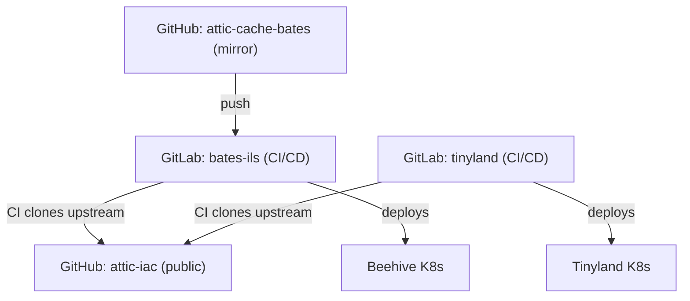

# Multi-Repo Layout

This document describes how the three repositories are hosted, mirrored,
and connected through CI/CD pipelines.

## Repository Topology

## The Three Repositories

### attic-iac (public upstream)

- **Host**: GitHub (`Jesssullivan/attic-iac`)
- **Visibility**: Public
- **Contents**: Shared OpenTofu modules, SvelteKit application source,
  documentation site, Bazel build tooling (`build/overlay.bzl`), and
  Nix flake for container builds.
- **Role**: Single source of truth for all reusable infrastructure
  components. Contains no institutional secrets or deployment-specific
  configuration.

### attic-cache-bates (Bates overlay)

- **Code mirror**: GitHub (`Jesssullivan/attic-cache-bates`)
- **CI/CD**: GitLab (`bates-ils/people/jsullivan2/attic-cache`,
  project ID 78189586)
- **Visibility**: Private
- **Contents**: Bates-specific tfvars, runner configurations,
  `organization.yaml`, CI pipeline definitions, and any files that
  override upstream defaults.
- **Remotes**:
  - `origin` points to the GitHub mirror (for code review and backup)
  - `gitlab` points to the GitLab project (for CI/CD execution)

Pushes to the GitHub mirror are forwarded to GitLab, which triggers
the CI pipeline.

### tinyland-infra (Tinyland overlay)

- **Host**: GitLab (`tinyland/tinyland-infra`, project ID 78322246)
- **Visibility**: Private
- **Contents**: Tinyland-specific overlay files.
- **Role**: Same overlay pattern as attic-cache-bates, targeting the
  Tinyland Kubernetes cluster.

## CI Pipeline Flow

Both overlay repositories follow the same CI pattern:

1. A push to the overlay repository triggers a GitLab CI pipeline.
2. The pipeline clones the public upstream repository from GitHub.
3. It symlinks upstream modules and source files into the overlay
   workspace, replicating the `@attic_merged` layout that Bazel
   produces locally.
4. OpenTofu runs `plan` and `apply` against the merged file tree.
5. On the `main` branch, deploys are automatic (not gated by manual
   approval).

This means the CI pipeline does not depend on Bazel itself. It
reproduces the overlay merge with shell-level symlinks, keeping the
CI environment lightweight.

## GitLab Accounts

Two separate GitLab accounts are involved:

- **jsullivan2_bates** (ID 21565163): Institutional account. Owner of
  the bates-ils group. PAT used for OpenTofu HTTP state backend. SSH
  access via `~/.ssh/gitlab-work`.
- **Jesssullivan** (ID 28461666): Personal account. Member of the
  tinyland group. PAT stored in sops-encrypted secrets. SSH access via
  default key.

## Deployment Targets

- **Beehive**: Bates development Kubernetes cluster. Deployed by the
  bates-ils GitLab pipeline.
- **Tinyland**: Separate Kubernetes cluster. Deployed by the tinyland
  GitLab pipeline.

Both clusters receive the same upstream infrastructure components
(Attic cache, runners, dashboard) but with institution-specific
configuration provided by their respective overlays.

## Related Documents

- [Bzlmod Topology](bzlmod-topology.md) -- how the overlay modules
  depend on upstream via Bzlmod
- [Overlay System](overlay-system.md) -- the symlink-merge mechanics
  that CI replicates
- [Recursive Dogfooding](recursive-dogfooding.md) -- the self-deploying
  property of the deployed infrastructure
