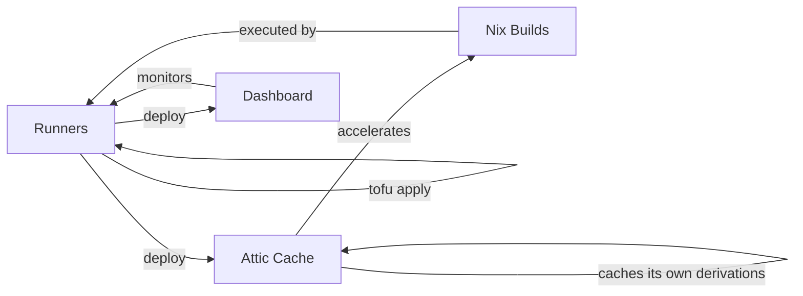

# Recursive Dogfooding

This is the central architectural concept of the attic-iac system:
**infrastructure that deploys and updates itself using itself**.

## Definition

Recursive dogfooding means that the tools, services, and pipelines
produced by this project are consumed by the same project to build,
test, and deploy subsequent versions of themselves. Each component
participates in a feedback loop where it is both producer and consumer.

## The Three Self-Referential Loops

### Runners Deploy Runners

GitLab runners are deployed via `tofu apply`, which updates their
Kubernetes manifests (resource limits, runner tokens, image versions).
The `tofu apply` command runs inside a CI pipeline, which itself
executes on those same runners. When a runner configuration change
merges to `main`, the runners execute a pipeline that reconfigures
themselves.

### Attic Cache Caches Its Own Derivations

The Attic binary cache server is built as a Nix derivation. That
derivation is stored in the Attic cache. On subsequent builds, Nix
fetches the cached closure from Attic rather than rebuilding from
source. The cache accelerates the build of the very artifact that
provides the cache.

### Dashboard Monitors Its Own Deployers

The runner dashboard is a SvelteKit application deployed by the CI
pipeline. Once running, it monitors the health and activity of the
runners that deployed it. If a runner degrades, the dashboard surfaces
that information, prompting a fix that the runners will then deploy.

## Convergence

The system converges over time. Each successful cycle improves the next:

- **Cache hits accumulate.** After the first build, Nix derivations are
  cached. Subsequent builds are faster because they fetch from Attic
  instead of rebuilding. Faster builds mean shorter CI cycle times.
- **Runner configuration stabilizes.** Each deployment applies the
  declared state. Configuration drift is corrected on every merge to
  `main`.
- **Monitoring improves visibility.** As the dashboard collects data
  across cycles, patterns emerge (build duration trends, failure rates)
  that inform further improvements.

The steady state is a system where builds are fast (high cache hit
rate), runners are correctly configured (no drift), and operators have
clear visibility into system health.

## Dependency Graph

## Bootstrap

The self-referential nature creates a chicken-and-egg problem on first
deployment. The system cannot deploy itself if it does not yet exist.
The bootstrap sequence breaks the cycle:

1. **Manual initial deploy.** The first `tofu apply` runs from a
   developer workstation (or a temporary CI runner outside the cluster).
   This creates the Kubernetes namespace, deploys the Attic cache with
   an empty store, and registers the initial set of runners.
2. **First CI pipeline.** With runners registered, the next push to
   `main` triggers a pipeline that runs on the newly created runners.
   This pipeline redeploys the same infrastructure, but now through the
   self-referential path.
3. **Cache warming.** The first Nix build has no cache hits and is slow.
   Its outputs are pushed to Attic. The second build is faster. After a
   few cycles, the cache is warm and builds reach steady-state speed.

After bootstrap, the system is self-sustaining. No external CI
infrastructure is needed.

## Degradation

The loops are loosely coupled through Kubernetes. If one component
fails, the others continue:

- **Attic cache down**: Nix builds fall back to nixpkgs.org or rebuild
  from source. Builds are slower but still succeed. Runners and
  dashboard are unaffected.
- **Dashboard down**: Monitoring is lost, but runners continue to
  execute pipelines and deploy infrastructure. The next pipeline run
  will attempt to redeploy the dashboard.
- **Runner degraded**: If one runner type fails (e.g., the Nix runner),
  pipelines that require that runner type will queue. Other runner types
  continue operating. The remaining runners can deploy a fix for the
  broken runner.
- **All runners down**: The self-referential loop is broken. Recovery
  requires the same manual intervention as bootstrap: a local
  `tofu apply` to recreate the runners.

The system is designed so that total failure of all components
simultaneously is unlikely. Partial failures are self-healing as long
as at least one runner type remains operational.

## Related Documents

- [RenovateBot Flywheel](renovatebot-flywheel.md) -- automated
  dependency updates that feed into the self-deployment loop
- [Bzlmod Topology](bzlmod-topology.md) -- the build system structure
  that produces the deployable artifacts
- [Multi-Repo Layout](multi-repo-layout.md) -- where the code lives
  and how CI pipelines are triggered
