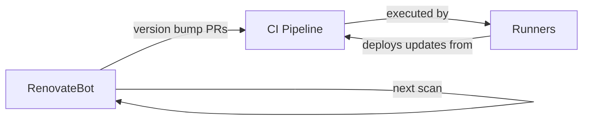

# RenovateBot Flywheel

This document describes how automated dependency updates form a
self-improving loop when combined with the
[recursive dogfooding](recursive-dogfooding.md) architecture.

## Overview

RenovateBot continuously scans the repository for outdated dependencies
and creates merge requests with version bumps. Those merge requests are
tested and deployed by the same infrastructure that RenovateBot is
updating. The result is a flywheel: each update cycle leaves the system
in a better state for the next cycle.

## What RenovateBot Scans

RenovateBot is configured to monitor three dependency manifests:

- **flake.nix** -- Nix flake inputs (nixpkgs, flake-utils, nix2container,
  and the attic-server source). Updates here change the Nix derivation
  outputs, which flow through to container images.
- **MODULE.bazel** -- Bazel module dependencies (rules_js, rules_ts,
  aspect_bazel_lib). Updates here change the build toolchain.
- **package.json** -- Node.js dependencies for the SvelteKit application
  (Skeleton, Tailwind, Chart.js, SvelteKit itself). Updates here change
  the application bundle.

## The Flywheel

The cycle proceeds as follows:

1. **Scan.** RenovateBot detects that a dependency has a newer version.
   It creates a merge request with the version bump and updated lockfile.
2. **Test.** The merge request triggers a CI pipeline. Self-hosted
   runners execute the pipeline, which runs `tofu validate`, `pnpm test`,
   and `bazel build` against the proposed change.
3. **Merge.** If the pipeline passes (and automerge is enabled for the
   dependency type), the merge request is merged to `main`.
4. **Deploy.** The merge to `main` triggers the deployment pipeline. The
   runners execute `tofu apply`, which deploys the updated infrastructure.
   If the update affects the runners themselves (e.g., a new runner image
   tag), the runners redeploy themselves.
5. **Next scan.** RenovateBot runs again on the now-updated codebase.
   Any transitive dependency changes introduced by the previous update
   are detected and the cycle repeats.

## Self-Improvement Property

Each cycle can improve the infrastructure in concrete ways:

- **Nix input updates** may include security patches for the base image
  or performance improvements in attic-server. After deployment, the
  cache serves content faster or more securely.
- **Build toolchain updates** (rules_js, rules_ts) may fix bugs or
  improve build performance. After deployment, CI pipelines run faster.
- **Application dependency updates** fix vulnerabilities and add features
  to the dashboard. After deployment, operators have better monitoring
  tools.

Because the infrastructure deploys itself, these improvements take
effect without manual intervention. The system trends toward its best
available state.

## Interaction with the Attic Cache

When a dependency update changes Nix derivation outputs (e.g., a new
nixpkgs pin), the first build after the update will miss the cache and
rebuild affected derivations. Those new derivations are pushed to Attic.
Subsequent builds (including the next RenovateBot cycle) benefit from
the updated cache. Over time, the cache always contains derivations for
the most recent dependency set.

## Guardrails

Fully automated updates carry risk. The following guardrails are in
place:

- **CI must pass.** No merge request is merged without a green pipeline.
  This catches breaking changes before they reach `main`.
- **Automerge scope.** Only patch and minor version bumps are
  automerged. Major version bumps require manual review.
- **Separate PRs.** RenovateBot creates one merge request per dependency
  update. If an update breaks the build, it is easy to identify and
  revert the specific change.
- **Deployment is idempotent.** `tofu apply` converges to the declared
  state. If an update introduces a bad configuration, the next
  corrective merge will restore the system.

## Related Documents

- [Recursive Dogfooding](recursive-dogfooding.md) -- the self-deploying
  architecture that makes the flywheel possible
- [Bzlmod Topology](bzlmod-topology.md) -- the build system that
  RenovateBot's MODULE.bazel updates feed into
- [Multi-Repo Layout](multi-repo-layout.md) -- where the CI pipelines
  run
