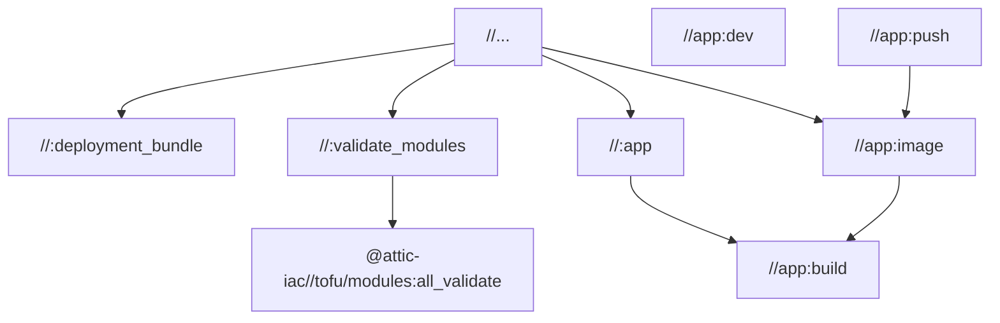

# Bazel Targets

This document lists the primary Bazel build targets available in the
project. Targets are listed from the perspective of the overlay
repository, which merges upstream and private files through the
`@attic_merged` repository rule (see
[Overlay System](../architecture/overlay-system.md)).

## Top-Level Targets

These targets are defined in the overlay repository root `BUILD.bazel`
and represent the most common build operations.

| Target | Description |
|---|---|
| `//...` | Build all targets in the workspace. This includes both overlay-defined targets and upstream targets pulled in through `@attic_merged`. Bazel's content-addressable cache ensures unchanged targets resolve instantly. |
| `//:deployment_bundle` | A `pkg_tar` archive containing overlay configuration files combined with upstream build artifacts. Used for deployment packaging. |
| `//:validate_modules` | Alias to `@attic-iac//tofu/modules:all_validate`. Runs `tofu validate` against all upstream OpenTofu modules. |
| `//:app` | Alias to `@attic-iac//app:build`. Produces the Vite production build of the runner dashboard SvelteKit application. |

## Application Targets

These targets are defined in `//app/` and operate on the SvelteKit
runner dashboard.

| Target | Description |
|---|---|
| `//app:build` | Vite production build. Compiles the SvelteKit application with adapter-node, producing a Node.js server bundle in `build/`. |
| `//app:dev` | Vite development server. Starts the SvelteKit dev server with hot module replacement. This is a `run` target, not a `build` target -- invoke it with `bazel run //app:dev`. |
| `//app:image` | OCI image manifest. Assembles a container image from the production build output using `image_layer` and `image_manifest` rules. |
| `//app:push` | Push the OCI image to `ghcr.io`. Requires registry authentication to be configured. Invoke with `bazel run //app:push`. |

## Target Dependency Graph



## Running Targets

Build targets are invoked with `bazel build`:

```bash
# Build everything
bazel build //...

# Build only the deployment bundle
bazel build //:deployment_bundle

# Validate all OpenTofu modules
bazel build //:validate_modules

# Build the SvelteKit app
bazel build //:app
```

Run targets (dev server, image push) are invoked with `bazel run`:

```bash
# Start the dev server
bazel run //app:dev

# Push the container image
bazel run //app:push
```

## Speculative Builds

Running `bazel build //...` is the recommended default. Bazel's
content-addressable cache means targets whose inputs have not changed
resolve as cache hits with negligible cost. Building everything ensures
that:

- Breakages in unrelated targets surface early.
- The deployment bundle always reflects the current state of all
  components.
- CI pipelines do not need to determine which subset of targets to
  build based on changed files.

This pairs with the [Greedy Build Pattern](greedy-build-pattern.md),
where the same `build //...` command runs immediately in CI without
waiting for validation.

## Related Documents

- [Greedy Build Pattern](greedy-build-pattern.md) -- CI pipeline
  strategy for speculative builds
- [Container Builds](containers.md) -- how `//app:image` and
  `//app:push` produce and distribute OCI images
- [Overlay System](../architecture/overlay-system.md) -- how upstream
  and private targets merge into a single workspace
