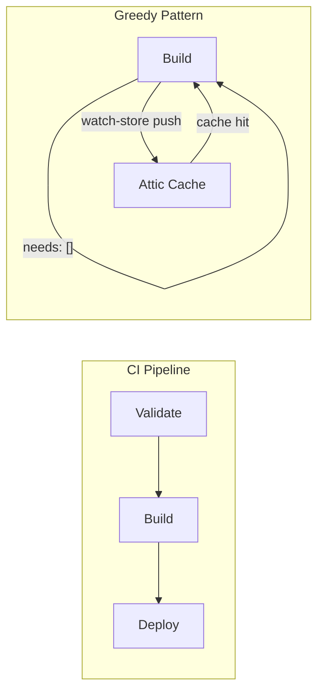

# Greedy Build Pattern

The greedy build pattern starts build jobs immediately -- before validation
completes -- and pushes results to the Nix binary cache as a non-blocking
side effect. This eliminates wasted time when validation fails and ensures
that every build, successful or not, contributes to the cache.

## Pipeline Topology

In a conventional pipeline, stages run sequentially: validate, then build,
then deploy. A validation failure means the build never starts, and no
artifacts are cached. The greedy pattern inverts this by removing the
dependency edge between validation and build:

Build jobs declare `needs: []` in GitLab CI, which tells the scheduler to
start them as soon as a runner is available, without waiting for any
upstream stage. Validation and build run in parallel. Deploy still depends
on both.

## Incremental Push with watch-store

Pushing to the cache only after a build finishes creates a fragile
all-or-nothing situation: if a 60-minute Nix build fails at minute 45,
zero derivations are cached and the next pipeline repeats all 45 minutes
of work.

The `attic watch-store` command solves this by monitoring `/nix/store` for
new paths during the build and pushing each one to the Attic cache as it
appears. If the build fails partway through, every derivation completed
before the failure is already in the cache. The next pipeline picks up
from where the previous one left off.

See [Watch-Store Bootstrap](watch-store.md) for the full bootstrap
sequence and implementation details.

## Bootstrap: Cached Attic Client Binary

The `attic` CLI is itself a Nix derivation. Building it from source
(Rust + Cargo) takes significant time, which defeats the purpose of
fast-start caching if every pipeline must compile the client before it
can push anything.

The bootstrap strategy avoids this:

1. Attempt to fetch the pre-built `attic` client from the cache using
   `nix build .#attic-client --max-jobs 0`. The `--max-jobs 0` flag
   restricts Nix to substituters only -- no local compilation.
2. If the client is in the cache (the common case after the first
   successful pipeline), start `attic watch-store` immediately in the
   background.
3. If the client is not in the cache (first pipeline, or cache was
   cleared), skip watch-store entirely and fall back to an end-of-build
   push. This seeds the cache so that subsequent pipelines have the
   client available.

The result is that only the very first pipeline pays the full compilation
cost. Every pipeline after that has sub-second access to the cached
client binary.

## Benefits

| Benefit | Mechanism |
|---|---|
| Roughly 50% faster iteration | Build and validate run in parallel instead of sequentially |
| Resumable builds | Partial results are cached incrementally, so failures do not reset progress |
| Higher cache hit rates | More derivations are cached because builds run regardless of validation outcome |
| Reduced CI compute cost | Cached derivations are fetched instead of rebuilt |
| Better parallelism | `needs: []` allows the scheduler to saturate available runners |

## Tradeoffs

| Consideration | Mitigation |
|---|---|
| Unvalidated code in cache | The cache is internal infrastructure, not a release channel. Validation gates still control deployment. Nothing reaches production without passing all checks. |
| Cache bloat from speculative builds | The Attic GC worker prunes old derivations on a configurable schedule. Short-lived feature branches contribute minimal additional store paths. |
| Pipeline complexity | The greedy pattern adds one concept (`needs: []`) and one background process (watch-store). Both are confined to the CI base template. |

## Integration with Greedy Bazel Builds

The same speculative philosophy applies to Bazel. Running `bazel build
//...` in the overlay repository builds all targets -- upstream and
private -- regardless of whether a specific change touches all of them.
This is deliberate: Bazel's content-addressable cache means rebuilding
an unchanged target is a no-op (cache hit), and building everything
ensures that breakages in unrelated targets surface early rather than in
a later pipeline.

Combined with the Nix greedy pattern, the full build flow is:

1. Pipeline starts. Build job launches immediately (`needs: []`).
2. Bootstrap fetches the cached `attic` client. watch-store begins
   monitoring `/nix/store`.
3. `nix build` compiles all Nix derivations. Each completed derivation
   streams to the Attic cache in real time.
4. `bazel build //...` runs against the merged overlay repository,
   producing all OpenTofu validations, the SvelteKit app bundle, and
   the deployment tarball.
5. Validation job runs in parallel. Deploy job waits for both build and
   validation to succeed.

See [Bazel Targets](bazel-targets.md) for the full list of build targets.

## Related Documents

- [Watch-Store Bootstrap](watch-store.md) -- incremental Nix store push
- [Container Builds](containers.md) -- OCI image build methods
- [Bazel Targets](bazel-targets.md) -- available build targets
- [Overlay System](../architecture/overlay-system.md) -- how upstream and
  private files merge at build time
