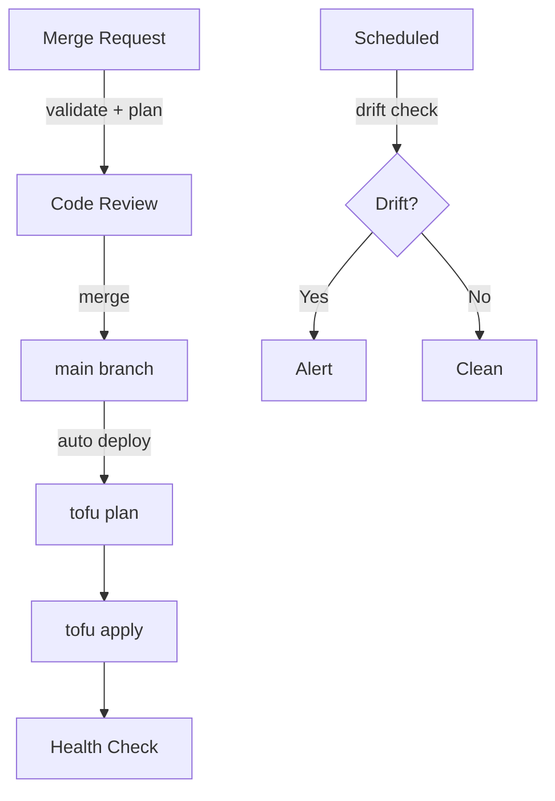

# Deployment Flow

This document describes how changes move from a developer commit to a running
production deployment, and how drift detection catches out-of-band changes.

## Merge Request Pipeline

When a merge request is opened or updated, the pipeline runs a subset of stages:

1. **Validate** -- format checks, schema validation, `tofu validate`
2. **Plan** -- generates execution plans for all affected stacks

The deploy stage is skipped. Plan output is posted as a comment or artifact so
reviewers can inspect the exact infrastructure changes before approving the merge.

## Main Branch Pipeline

After a merge request is approved and merged into `main`, the full pipeline runs
automatically. There is no manual gate or approval step.

1. **Validate** -- same checks as the MR pipeline
2. **Build** -- compiles the SvelteKit app, builds the container image
3. **Plan** -- generates fresh execution plans from the merged code
4. **Deploy** -- runs `tofu apply` with the saved plan artifacts
5. **Verify** -- executes health checks against deployed services

### Plan-Apply Handoff

The plan artifact produced in the Plan stage is passed directly to the Deploy
stage. This guarantees that `tofu apply` executes exactly the changes that were
planned, with no opportunity for drift between planning and applying.

### Health Checks

The Verify stage confirms that deployed services are healthy:

- HTTP GET against known health endpoints
- Kubernetes pod readiness verification
- Runner registration confirmation (for runner stacks)

A failed health check marks the pipeline as failed and triggers notification.

## Drift Detection

A scheduled pipeline runs at a configured interval (typically daily) independent
of any code change. It executes:

```bash
tofu plan -detailed-exitcode
```

The `-detailed-exitcode` flag causes tofu to exit with code 2 if the plan detects
changes (drift) between the declared state and the actual cluster state. Exit
code 0 means no drift.

When drift is detected, the pipeline raises an alert. The team can then choose to:

- Apply the existing code to bring the cluster back in line
- Update the code to reflect intentional manual changes
- Investigate and revert unauthorized modifications

## Flow Diagram



## Related

- [Pipeline Overview](./pipeline-overview.md) -- stage-by-stage reference
- [Overlay Pipelines](./overlay-pipelines.md) -- how overlays customize the flow
- [OpenTofu Modules](../reference/tofu-modules.md) -- modules deployed by the pipeline
