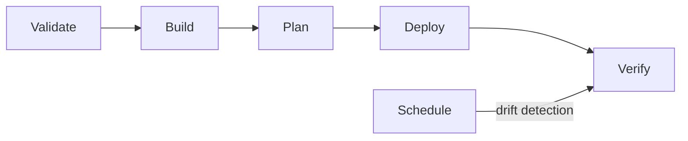

# Pipeline Overview

The upstream attic-iac CI/CD pipeline is structured around five sequential stages
that take changes from validation through to production deployment.

## Stages

### 1. Validate

Static checks that run before any build or deploy work begins.

- **Organization config validation** -- parses `organization.yaml` and checks
  schema conformance, required fields, and cross-references between runners,
  environments, and cache settings.
- **tofu fmt --check** -- ensures all `.tf` files follow canonical formatting.
- **tofu validate** -- runs `tofu validate` against every module in
  `tofu/modules/` to catch syntax errors, missing variables, and provider
  misconfigurations.

### 2. Build

Produces the artifacts needed by later stages.

- **App build (Vite)** -- runs `pnpm install && pnpm build` for the
  SvelteKit runner-dashboard application using adapter-node.
- **Container image build** -- builds the OCI image for the dashboard
  (via Dockerfile or Nix, depending on platform).

### 3. Plan

Generates OpenTofu execution plans for each infrastructure stack.

- **attic** -- plans the cache platform stack (CNPG operator, PostgreSQL cluster, MinIO operator + tenant, Attic API server, GC worker, DNS records, optional Bazel cache).
- **runners** -- plans the GitLab Runner stack (all runner types, HPA, RBAC).
- **dashboard** -- plans the runner-dashboard stack (deployment, service, ingress).

Each plan is saved as an artifact and passed to the deploy stage.

### 4. Deploy

Applies the saved plans from the previous stage.

- Runs `tofu apply` using the exact plan artifact produced in the Plan stage.
- No interactive approval -- deployment is automatic on the main branch.

### 5. Verify

Post-deployment health checks confirm services are running.

- HTTP health checks against deployed endpoints.
- Kubernetes readiness probe verification.
- Runner registration status check.

## Drift Detection

A scheduled pipeline runs independently of code changes. It executes
`tofu plan -detailed-exitcode` against each stack. A non-zero exit code
indicates configuration drift (manual changes made outside of tofu), which
triggers an alert.

## Pipeline Diagram

## Related

- [Overlay Pipelines](./overlay-pipelines.md) -- how downstream repos extend this pipeline
- [Deployment Flow](./deployment-flow.md) -- how changes move from commit to production
- [OpenTofu Modules](../reference/tofu-modules.md) -- module reference for planned stacks
