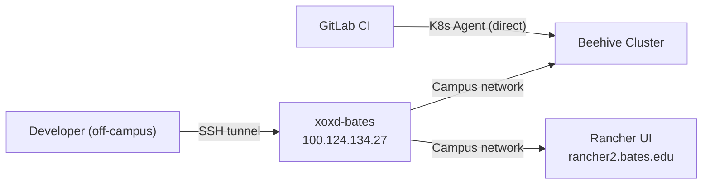

# Proxy and Access

The beehive development cluster runs on campus infrastructure behind a firewall. Off-campus access requires a SOCKS5 proxy through a Tailscale node. CI pipelines bypass this requirement entirely by using the GitLab Kubernetes Agent.

## Network Topology



## Starting the SOCKS Proxy

The Justfile provides a convenience command:

```bash
just proxy-up
```

This starts a SOCKS5 proxy by opening an SSH tunnel through the Tailscale node `xoxd-bates` (IP `100.124.134.27`). The tunnel runs in the background on `localhost:1080`.

Under the hood, the command runs:

```bash
ssh -fN bates-socks
```

This relies on an SSH config entry named `bates-socks` that defines the Tailscale host and dynamic port forwarding. Ensure your `~/.ssh/config` includes the appropriate entry.

## Using kubectl Through the Proxy

Direct `kubectl` calls will fail off-campus because they cannot reach the cluster API server. The Justfile wraps kubectl with the proxy:

```bash
just bk get pods -n attic-cache-dev
just bk logs -n bates-ils-runners <pod-name>
```

`just bk` is shorthand for running `kubectl` with `HTTPS_PROXY=socks5h://localhost:1080` set in the environment.

## Using curl Through the Proxy

For ad-hoc HTTP requests to cluster services or the Rancher API:

```bash
just bcurl https://rancher2.bates.edu/v3/clusters
```

`just bcurl` wraps `curl` with the same SOCKS proxy configuration.

## Setting the Proxy for OpenTofu

When running `tofu plan` or `tofu apply` against beehive from off-campus, export the proxy before invoking tofu:

```bash
export HTTPS_PROXY=socks5h://localhost:1080
tofu plan -var-file=...
```

The `socks5h://` scheme (note the trailing `h`) ensures that DNS resolution also goes through the proxy, which is required for resolving internal hostnames.

## Rancher UI

The Rancher management interface is available at:

```
https://rancher2.bates.edu
```

Access requires the SOCKS proxy when off-campus. Use it to:

- Download kubeconfig files for local development
- Monitor cluster health and workloads
- Inspect logs and events

## kubeconfig-beehive

The kubeconfig file for the beehive cluster is **not checked into version control** (it is listed in `.gitignore`). To obtain it:

1. Start the proxy: `just proxy-up`
2. Open Rancher at `https://rancher2.bates.edu` (configure your browser to use `localhost:1080` as a SOCKS proxy, or use a proxy-aware browser extension).
3. Navigate to the beehive cluster and download the kubeconfig.
4. Save it as `kubeconfig-beehive` at the repository root (or overlay root).

The file contains cluster credentials and must not be committed or shared.

## CI Pipelines -- No Proxy Needed

GitLab CI pipelines do not use the SOCKS proxy. Instead, they authenticate via the GitLab Kubernetes Agent, which provides a direct, authenticated channel to the cluster:

```
bates-ils/projects/kubernetes/gitlab-agents:beehive
```

This agent path is configured in the CI tfvars files. The pipeline runner communicates with the agent through GitLab's infrastructure, bypassing the campus firewall entirely.

## Troubleshooting

| Symptom | Likely Cause | Fix |
|---------|-------------|-----|
| `kubectl` hangs or times out | Proxy not running | Run `just proxy-up` |
| `connection refused` on port 1080 | SSH tunnel died | Kill stale SSH processes, re-run `just proxy-up` |
| DNS resolution failures | Using `socks5://` instead of `socks5h://` | Use `socks5h://` to proxy DNS |
| Certificate errors from Rancher | Proxy not forwarding correctly | Verify `~/.ssh/config` entry for `bates-socks` |
| CI pipeline cannot reach cluster | Agent not installed or misconfigured | Check GitLab Agent status in Rancher |

## Related Documentation

- [Quick Start](./quick-start.md) -- full deployment walkthrough
- [Clusters and Environments](./clusters-and-environments.md) -- namespace layout and auth details
- [Customization Guide](./customization-guide.md) -- organization.yaml reference
