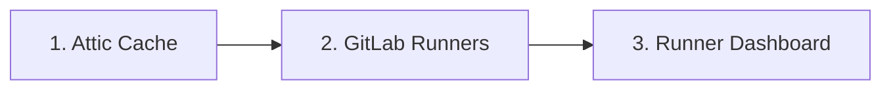

# Quick Start

A consolidated guide for deploying the Attic cache infrastructure from scratch or from an overlay repository.

## Prerequisites

Install the following tools before proceeding:

| Tool | Purpose | Notes |
|------|---------|-------|
| **Nix** (with flakes enabled) | Reproducible builds, container images, devShell | `experimental-features = nix-command flakes` in `nix.conf` |
| **kubectl** | Kubernetes cluster access | Provided by the devShell |
| **OpenTofu** | Infrastructure provisioning | Provided by the devShell |
| **direnv** | Automatic environment loading | Hooks into `.envrc` at repo root |

## Clone and Enter the DevShell

```bash
git clone https://github.com/Jesssullivan/attic-iac.git ~/git/attic-iac
cd ~/git/attic-iac
direnv allow
```

If you prefer not to use direnv, enter the shell manually:

```bash
nix develop
```

The devShell provides pinned versions of `tofu`, `kubectl`, `pnpm`, `node`, and other tooling.

## Configure organization.yaml

`organization.yaml` is the single source of truth for all deployment parameters. Edit it to match your cluster and organization details:

```yaml
organization:
  name: your-org
environments:
  beehive:
    cluster_context: beehive
    # ...
```

See the [Customization Guide](./customization-guide.md) for a full breakdown of every field.

## Initialize OpenTofu Backends

Each stack uses a GitLab HTTP backend for remote state. Initialize them one at a time:

```bash
cd tofu/stacks/attic
tofu init \
  -backend-config="address=https://gitlab.com/api/v4/projects/<PROJECT_ID>/terraform/state/attic-beehive" \
  -backend-config="lock_address=https://gitlab.com/api/v4/projects/<PROJECT_ID>/terraform/state/attic-beehive/lock" \
  -backend-config="unlock_address=https://gitlab.com/api/v4/projects/<PROJECT_ID>/terraform/state/attic-beehive/lock" \
  -backend-config="username=<GITLAB_USERNAME>"
# TF_HTTP_PASSWORD env var provides the GitLab PAT for authentication
```

Repeat for each stack (`attic`, `gitlab-runners`, `runner-dashboard`), substituting the appropriate state name (`{stack}-{env}`).

## Deployment Order

Deploy the components in the following sequence. Each step depends on the one before it.



### Step 1 -- Attic Cache

The cache must be running first because runners reference it via the `ATTIC_SERVER` environment variable.

```bash
cd tofu/stacks/attic
tofu plan -var-file=../../../tfvars/attic-beehive.tfvars
tofu apply -var-file=../../../tfvars/attic-beehive.tfvars
```

Verify:

```bash
kubectl -n attic-cache-dev get pods
# Expect: atticd pod Running, CloudNativePG cluster Ready
```

### Step 2 -- GitLab Runners

```bash
cd tofu/stacks/gitlab-runners
tofu plan -var-file=../../../tfvars/runners-beehive.tfvars
tofu apply -var-file=../../../tfvars/runners-beehive.tfvars
```

Verify:

```bash
kubectl -n bates-ils-runners get pods
# Expect: one pod per runner type (docker, dind, rocky8, rocky9, nix)
```

### Step 3 -- Runner Dashboard

```bash
cd tofu/stacks/runner-dashboard
tofu plan -var-file=../../../tfvars/dashboard-beehive.tfvars
tofu apply -var-file=../../../tfvars/dashboard-beehive.tfvars
```

Verify:

```bash
kubectl -n runner-dashboard get pods
# Expect: dashboard pod Running
```

## Overlay Deployments

If you are deploying from an overlay repository (for example, a campus-specific configuration layered on top of the upstream project):

1. Clone both repos as siblings:

```bash
git clone https://github.com/Jesssullivan/attic-iac.git ~/git/attic-iac
git clone <overlay-repo-url> ~/git/attic-cache-bates
```

2. The overlay `MODULE.bazel` already declares a `local_path_override` pointing to the upstream sibling directory:

```starlark
local_path_override(
    module_name = "attic-iac",
    path = "../../attic-iac",
)
```

Adjust the `path` value if your directory layout differs.

3. Run Bazel and OpenTofu commands from within the overlay directory. The overlay's tfvars files supply campus-specific values, while the upstream `.tf` files provide the module definitions.

```bash
cd ~/git/attic-cache-bates
tofu -chdir=../attic-iac/tofu/stacks/attic plan \
  -var-file=~/git/attic-cache-bates/tfvars/attic-beehive.tfvars \
  -var cluster_context=beehive \
  -var k8s_config_path=$HOME/git/attic-cache-bates/kubeconfig-beehive
```

4. For off-campus deployments, start the SOCKS proxy first. See [Proxy and Access](./proxy-and-access.md) for details.

## Next Steps

- [Customization Guide](./customization-guide.md) -- configure organization.yaml for your site
- [Clusters and Environments](./clusters-and-environments.md) -- understand the namespace layout
- [Proxy and Access](./proxy-and-access.md) -- off-campus connectivity
